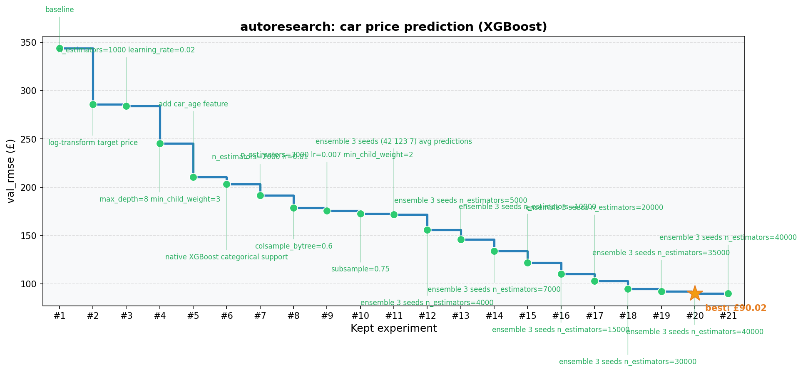

# autoresearch

The idea: give an AI agent a real ML training setup and let it experiment autonomously. It modifies the code, trains a model, checks if the result improved, keeps or discards, and repeats. You wake up to a log of experiments and (hopefully) a better model.

This repo applies that idea to **car price prediction** using XGBoost on `car_sales_data.csv` (50,000 UK used car listings). The agent iterates on `train.py` — feature engineering, hyperparameters, target transformations — trying to minimize validation RMSE.



## How it works

The repo has three files that matter:

- **`prepare.py`** — fixed constants, data loading, train/val split (80/20, pinned seed), and the ground-truth evaluation metric (`val_rmse`). **Not modified.**
- **`train.py`** — the single file the agent edits. Feature engineering, XGBoost model, hyperparameters. **This file is edited and iterated on by the agent.**
- **`program.md`** — baseline instructions for one agent. Point your agent here and let it go. **This file is edited and iterated on by the human.**

The metric is **val_rmse** (validation RMSE in £) — lower is better. The train/val split is fixed so all experiments are directly comparable.

## Quick start

**Requirements:** Python 3.10+, [uv](https://docs.astral.sh/uv/). On macOS also run `brew install libomp`.

```bash
# 1. Install uv (if you don't already have it)
curl -LsSf https://astral.sh/uv/install.sh | sh

# 2. Install dependencies
uv sync

# 3. Run a single experiment
uv run train.py
```

## Running the agent

Open Claude Code in this repo and type:

```
start autoresearch
```

Claude will read `program.md`, ask how long to run, then iterate autonomously — modifying `train.py`, training, keeping improvements, and committing directly to master.

## Project structure

```
prepare.py          — fixed data loading, train/val split, evaluation metric (do not modify)
train.py            — feature engineering + XGBoost model (agent modifies this)
plot.py             — generates progress.png from results.tsv (do not modify)
program.md          — agent instructions
car_sales_data.csv  — 50,000 UK used car listings (Manufacturer, Model, Engine size, Fuel type, Year, Mileage, Price)
results.tsv         — experiment log (keep/discard history)
pyproject.toml      — dependencies
```

## Design choices

- **Single file to modify.** The agent only touches `train.py`. This keeps the scope manageable and diffs reviewable.
- **Fixed val split.** The 80/20 split uses a pinned seed, so every experiment is evaluated on the exact same 10,000 rows. Results are directly comparable regardless of what the agent changes.
- **Commits to master.** Improvements are committed directly to master — no feature branches.
- **Auto chart.** `progress.png` is regenerated after every `uv run train.py`, showing only kept experiments sorted by val_rmse.

## License

MIT
